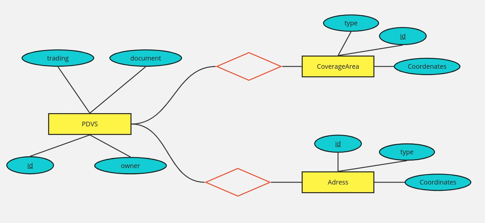
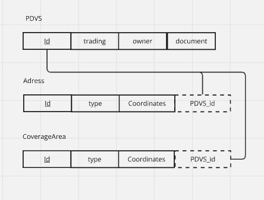

# Zé Code   Desafio Backend
## 🍻 Apresentação

Zé Deliver é um aplicativo que nunca te deixa na mão quando acaba a cerveja, pois te permite pedir bebidas onde e como quiser. 

Além do aplicativo permitir essa dinâmica flexivel ao fazer seu pedido, você receberá sua cerveja sempre gelada, pronta para beber e no conforto de sua casa, uma vez que a empresa se baseia em uma rede de estabelecimentos e o aplicaitvo garente que o seu pedido sempre será encaminhado para o mais proximo de você para atender essas demandas. 

O projeto apresentando consiste na organização desses parceiros e construção de um programa que busque aquele que se encontra mais proximo da coordenada inserida pelo cliente. 

## 💾 Banco de Dados

O banco de dados do projeto tem como objetivo organizar em tabelas as inforamações dos parceiros neste arquivo [JSON](pdvs.json)

**Modelo Entidade Relacionamento:**

 

 Diagrama que representa as relações entre as entidades no banco 

 

 Representação ER do projeto no formato das tabelas 

**Tabelas:**
As tabelas do banco de dados se encontram [aqui](BDs)

pdvs.csv -> tabela bruta que é a versão convertida do JSON direto em csv. As próximas tabelas foram criadas derivadas dessa para criar as entidades do banco de dados.

Parceiros.csv -> armazena as informações principais de cada parceiro do Zé Deliver. No JSON, essa tabela engloba os campos `tradingName`, `ownerName` e `document`

CoverageAreas.csv -> as informações seguem o padrão `GeoJSON MultiPolygon` para desenhar a area de atuação de cada parceiro. No JSON, essa tabela engloba os campos `coverageArea` e `type` para cada um dos clientes, representados pelo <ins> id </ins>	

**Extra:** a pasta 'Popular_bancos' dentro do diretorio 'BDs' possui os codigos python desenvolvidos para manipular a tabela pdvs.csv e popular as entidades do banco de dados

